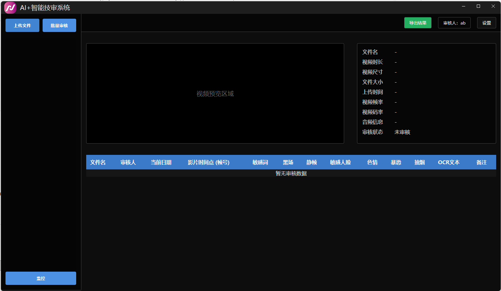

# AI-Promot

AI视频检测审核

## 功能特性
AI视频企业级检测项目，可检测色情、暴力、敏感语音、敏感文字、敏感人脸、黑屏、静止帧、抽烟等

## 环境要求

- Python 3.10
- Conda（推荐）或 Miniconda

## 安装步骤

### 1. 安装 Conda
如果您还没有安装 Conda，请先安装：
- [Miniconda](https://docs.conda.io/en/latest/miniconda.html)（推荐）
- 或 [Anaconda](https://www.anaconda.com/download)

### 2. 创建并激活 Conda 环境
```bash
# 创建名为 myenv 的 Python 3.10 环境
conda create -n myenv python=3.10

# 激活环境
conda activate myenv

### 3. 安装依赖
pip install -r requirements.txt

### 4. 运行应用
conda activate myenv
python api.py --mode api


###5. 下载运行下面exe文件
通过网盘分享的文件：Myapp.rar
链接: https://pan.baidu.com/s/14hI28s4RCjcUYkyGYKZSrw?pwd=7uis 提取码: 7uis 
--来自百度网盘超级会员v5的分享

```

## 界面预览

<div align="center">
  
  <br>

</div>
## 🎥 功能演示

<div align="center">
  <video width="600" controls>
    <source src="演示.mp4" type="video/mp4">
    您的浏览器不支持视频播放。
  </video>
  <br>
  <em>实时语音识别演示 - 边说边显示，延迟低于200ms</em>
</div>

